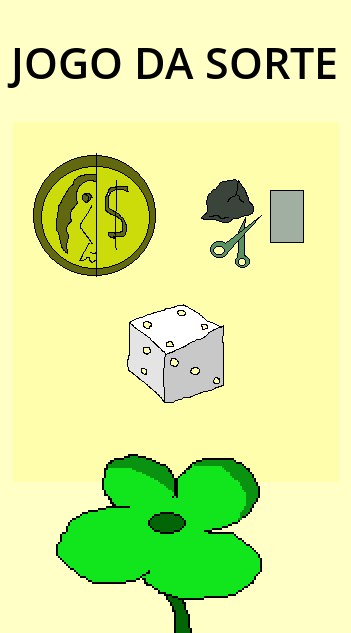
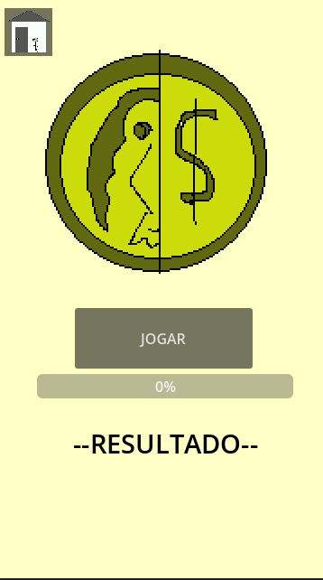
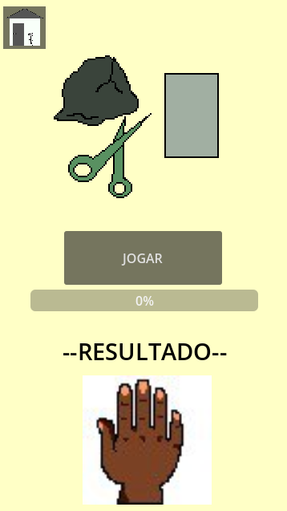
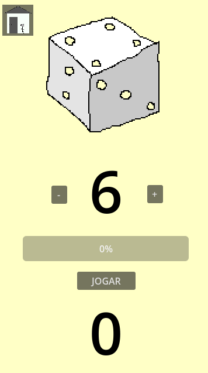

# Jogos de Sorte - Godot

Este projeto foi desenvolvido como parte do curso de longa duração em Cultura Digital do Centro Cultural do Bom Jardim. O foco principal desta atividade foi o aprendizado de manipulação de números aleatórios e a modularização de scripts e cenas dentro da plataforma Godot.

## Tabela de Conteúdos
1. [Sobre o Projeto](#sobre-o-projeto)
2. [Tecnologias Utilizadas](#tecnologias-utilizadas)
3. [Instalação e Execução](#instalação-e-execução)
4. [Funcionalidades](#funcionalidades)
5. [Imagens](#imagens)

---

## Sobre o Projeto

Este é o primeiro projeto utilizando a plataforma Godot. O objetivo é explorar a geração de números aleatórios para criar jogos de sorte, bem como aprender a modularizar scripts e cenas. O projeto inclui três jogos: **rolagem de dados**, **simulação de jokenpo**, e **cara ou coroa**, todos desenvolvidos com o motor Godot e script em GDScript.

## Tecnologias Utilizadas

- **Godot** - Game Engine usada para o desenvolvimento
- **GDScript** - Linguagem de script nativa do Godot para programação
- **Git** - para controle de versão  

## Instalação e Execução

### Pré-requisitos

- **Godot Engine** - [Baixe aqui](https://godotengine.org/download)
- Versão recomendada: 3.5 ou superior
- [Outras dependências específicas, se houver]

### Passos de Instalação

1. Clone este repositório:
    ```bash
    git clone https://github.com/seu-usuario/nome-do-projeto.git
    ```

2. Abra o projeto no Godot:
    - Abra o Godot e selecione "Importar" para adicionar o diretório do projeto.

3. Execute o projeto:
    - Escolha a cena principal e clique no botão de execução (Play).

## Funcionalidades

- **Cena de Rolagem de Dados**: Um jogo onde o jogador pode personalizar a quantidade de faces do dado e rolar para obter um resultado aleatório.
- **Cena de Simulação de Jokenpo**: Um jogo de pedra, papel e tesoura contra o computador, com resultados baseados em escolhas aleatórias.
- **Cena de Cara ou Coroa**: Um jogo simples de cara ou coroa com um resultado aleatório.

## Imagens


*Interface principal do jogo.*


*Cena de Cara ou Coroa.*


*Cena de Simulação de Jokenpo.*


*Cena de Rolagem de Dados.*
